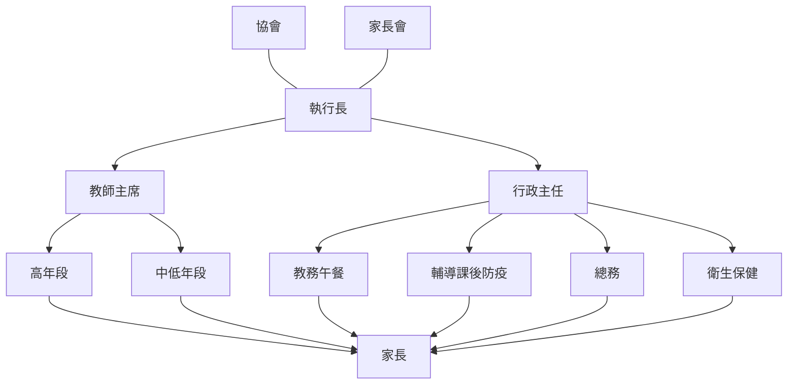

# 臺北市同心華德福實驗教育機構 Website Content

## 1. 首頁 (Home)

- **同心華德福教育8分鐘精華:** <https://youtu.be/oermgcwIkC8>您是否也在找尋教育孩子的不同路徑？ 您想改變嗎？ 您願意更勇敢的面對父母的角色嗎？ 您知道是因為孩子，我們才有機會成為更好的大人嗎？ 邀請您，成為同心的夥伴！
- **同心戲劇課程 紀錄短片:** <https://youtu.be/CXcjtafDnWc>六年級戲劇公演像是見證孩子成長的一場儀式，在預備過程中真實去看見彼此的短處和亮點，藉由一起做道具發揮想像力、一起排練凝聚向心力，拼出大家對這齣戲的想像。 當前方有共同的大目標，彼此從原先各自關注不同事物到被戲劇凝聚起來，一起在戲劇中生活、學習，一起希望能做的更好，戲劇公演最主要的意義，是建立「個人自信」、「彼此真實的關係」和「珍貴的同窗回憶」。
- **中學是一場自我革命:** <https://youtu.be/-kLpchWvdh4>中學是開始更進入探索自我的年紀，我們該如何引導他認識自己、挑戰自己？ 讓他明白，「這就是對我自己的一場革命！」 我們又如何陪伴他投入社會，在參與中摸索自我的定位，變成一個有溫度、能永遠「繼續前進的那個我」？ 這些答案，在華德福中學教育的辦學過程中；點點滴滴，期待與您分享與相遇。
- **校內宣導:**
    - [校園性別事件防治與處理](https://www.gender.edu.tw/web/index.php/m7/m7_02_01_01?sid=74)
    - ◇學籍友好◇實踐國小 <https://www.zjps.tp.edu.tw/nss/p/index> 實踐國中-學生專區 <https://ww1.sjjh.tp.edu.tw/nss/p/students>
    - [防範一氧化碳中毒](https://www.nfa.gov.tw/cht/index.php?code=list&ids=583)
- **網站管理：** 吳星螢 / 王姿尹

## 2. 最新消息 (Latest News)

- **🚩🚩🚩 家長接送臨停特別注意事項（重要置頂）**
    - 近一年來由於1999、教育局和實驗教育中心一直不斷接獲學校周邊民眾投訴，表示上放學期間家長汽車違停在試院路上等待接送孩子的問題，「已嚴重影響用路人視線造成民眾困擾」。
    - 同心教師團在此向各位家長呼籲，木柵路一段屬臺北市主要幹道之一，車流量不分時段皆大；試院路（雙號）在校園側路幅較窄，加上上放學時間與世新大學學生上下課時段重疊，車流量亦不小，因此：
        1. 校門口前木柵路一段已劃設紅線，禁止停車；該處也是交通警察執法取締臨停之重點。
        2. 試院路（雙號）在校園側設有「二處」黃線區，「原則上」可臨停讓孩子上下車，但不得佔用超過3分鐘。
        3. 若該二處黃線區皆停有車輛，請務必繼續向世新大學方向開去，巷內路幅較寬，二側設有收費停車格可暫停（9:00前免費）；此外，校園附近還有木柵路一段76巷路旁腹地、191巷旁收費停車處，以及和興路84巷收費停車格等處，皆可臨停。
        4. 國家考場地下停車場有30分鐘內停車免收費措施，歡迎多加利用。
- **【最新徵人訊息】同心華德福實驗教育機構 徵【中學理科教師】**
    - 𖡼𖡼𖡼用實驗與想像，點燃孩子對自然與宇宙的好奇𖡼𖡼𖡼
    - 在華德福教育裡，理科不只是公式與定律，而是理解世界的橋樑。
    - 擅長教授基礎自然、物理、化學或生物概念
    - 能設計實驗、觀察與生活連結的教學
    - 願從故事、觀察與探究出發，啟發孩子的思辨與驚奇
    - 有中學教學經驗或理工背景尤佳
    - 我們提供的不只是工作，而是一段深具意義的教育旅程：
        - 華德福教育師資訓練與進修機會
        - 溫暖團隊、支持性校園氛圍
        - 自然共處、充滿節奏感的教育現場
    - **投遞方式**
        - 請將履歷＋理念簡述寄至：tx@tongxin-waldorf.org
        - 主旨註明：「應徵理科教師－您的姓名」
        - 聯絡方式：02-2236-6791 (教務-廖老師)

## 3. 申請入學 (Admissions)

- 114學年 小一與七年級新生入學說明會已結束
- 七年級新生收件截止日為114/4/28
- "欲申請入學請完整填寫以下兩項:"
    1.  **線上填表連結：** <https://forms.gle/MXLUeQeE3Y59awJN8>
    2.  **入學申請書(紙本郵寄或Email):** 請下載填寫:入學申請書([word](https://docs.google.com/document/d/1PsnhlhVqFkUEhWoYVXY-dZRGexrvYM-v/edit))
- **Email：** tx@tongxin-waldorf.org
- **本機構地址：** 116臺北市文山區試院路2號
- 如欲轉學，由於每個班級的名額與情況不同，請先來信詢問，謝謝。

### 入學說明會流程圖
入學說明會 -> 官網下載申請書,並以紙本或E_mail回傳
#### 一年級新生
官網下載申請書,並以紙本或E_mail回傳 -> 親師面談 -> 正式入學
#### 各年級轉學生
官網下載申請書,並以紙本或E_mail回傳 -> 親師面談 -> 入班體驗試讀 -> 正式入學

## 4. 常見問答 (FAQ)

### 1. 如何看待孩子/一個人?
在同心這個家,我們不需要創造奇蹟,因為它無所不在。
每個孩子來到我們面前,都是兩個豐盛的相遇
每個孩子都是一個謎,需要從不同的線索來遇見他
孩子也是我們的一面鏡子,看見孩子的行為表徵,同時也內觀自己的不足之處
透過兒童觀察
我們將從孩子的五官特徵、身體表現、人格特質、四種氣質(風火水土)、十二感官
以及意志/情感/思考等各種面向來對孩子有更多的瞭解與認識。
符應孩子的身心發展階段,期盼能使孩子成為如其所是的人。

### 2. 同心的教學方法?
順應孩子每個階段的發展任務
給予深化連結的課程活動與故事
符應人智學的教與思維脈絡
7-14歲的孩子最主要的發展是發展「情感」面向的學習。
7-8歲在情感中鍛鍊意志,透過親身感官接觸與自然相處,
以及在生活中練習工作規律與秩序,孩子建立動手做的能力
9歲的孩子透過農耕與建築的課程找到內在與世界連結的安全感
10歲的孩子走出校園探訪地方社區,帶著內在旺盛的生命力開始向外探索
11歲的孩子身心達到和諧平衡的狀態
植物學的課程開啟了第一堂客觀的科學課入門
語文言文則的人類發展說寫讀讓孩子的語感長出豐沛的力量
藝術美勞課程會參孩子力與美的展現
12歲之後逐漸個人情感中的思維
科學、天文學、地理等課程這次帶領孩子運用感官「客觀」觀察自然的運行
進入探索宇宙與牠的學說旅程,延續連結中學的課程
跟身經驗、感官觀察、故事圖像的教學方法
體驗式捲疊每一個學習階段的發展能力
孩子內在習得的不只是知識而是生命的感受與經驗反芻後的記憶

### 3. 聽說華德福的孩子都在玩, 玩得出什麼學問嗎?
孩子在戶外體驗中學到的不只是技能與知識
更透過外在的探索發現內在心靈的各個面向

### 4. 同心華德福的生活節奏以及課程特色?
同心的生活節奏如下:
#### 週期循環主課程
包括語文、數學、自然科學、社會(歷史、地理)等科目。
每天上午8:20-10:20 進行120分鐘教學,
連續二到四週,教學貼周而復始地進行。
- 小學階段由主帶教師負責主課程。
- 中學階段將依主課科目,由專職教師授課。
#### 副課程
手工、藝術、外語、寫生、農藝、泥塑、音樂、
木工、音樂、體育活動等,每週或隔週固定時段上課。
由該科目的專業教師帶領課程

### 5. 孩子的學習表現?能力如何評量?
如何了解孩子的能力與學習狀態?
在華德福教育當中,我們著重兩個面向的發展。
一是生理發展,其二是心理與認知發展。
透過每天的晨圈活動及動態性課程,教師訓練孩子的身體協調性,及觀察所有感官の發展。
從一到九年級,透過工作本記錄孩子每天的學習。
教師及家長便能從孩子的工作本了解孩子的每日學習進程。
每日的活動過程當中,教師設計相關的教學活動,以瞭解孩子學科的學習狀態。
五年級起,由於孩子抽象思考能力的發展,課程中則會增添部分紙筆測驗。
每學期至少安排一次親師面談
面談過程當中會一同閱讀孩子的工作本,瞭解孩子在學校學習狀態。
另外,學期結束也將提供家長一份孩子個別的學習質性評量,給予孩子發展狀態,和各學科學習能力的描述。

### 6. 未來轉銜的可能性
華德福教育有別人花魁的發展圖像
從幼兒園到高中
我們期待培養出健全、獨立、自主的人
華德福教育有別人完整的發展圖像,從幼兒園到高中。我們期待培養出健全、獨立、自主的人
華德福教育(含實驗教育)的目標是培養人的整體發展,期盼能發展出人的主動、能動、能從眾與能共好
是一群,透過華德福教育,設計讓教育之美,社會改革的先鋒
同心截至108學年度,學校第七年級到九年級。我們同樣有從幼兒園到高中的辦學圖像
在還沒有高中部之前,九年級的畢業生也能夠依據對自己的瞭解
選擇符合與各式升學管道(包括華德福高中、特色獨招等)

### 7. 華德福學校畢業生的發展?
同心的畢業生都有華德福學校的畢業證書,同心也會給每個畢業生屬於同心華德福的畢業證書
從過去的經驗觀察到,華德福學校畢業後的孩子能夠獨當一面,自主自立,同時積極參與社會裡
根據社會企業的需求而來
企業親睞的人才,人品佳、能獨立解決問題、能團隊合作是其核心的三項能力
以此來看,華德福學校的畢業生在各行各業都是充滿競爭力的
除此之外,華德福學校依然充滿身心平衡的行為
畢業生在其生命自然之下,也踏實務實、美、勇敢在自己的生命核心中
帶著這個核心,從華德福學校的畢業生無論在各行各業都能夠完成自我,綻放出獨特的樣貌。

### 8. 華德福老師的特質?
「我們相信孩子的能力成為「人」才,唯有出自真正的人。
我們的華德福教育從來不只學科知識上的,孩子無時無刻也都是學習著教師的人品、人格)
因此我們期許自己能抱持一顆無愧於孩子的心,願意成為能引導孩子仿效的鏡像,發自心靈平穩的成人
- 對孩子有愛心與耐心,仁慈、寬厚,願意主動關懷且無差別地對待每一個孩子
並能深度理解每位孩子的發展及需求,與孩子真實地相處。
- 教師必須勇於探索,嘗試適合孩子的教育與引導,持續自我精進,主動參與華德福師資進修與課程
願真實地應對自身不足之處,自我檢視與勇敢約束,不害怕犯錯。
最重要的是在孩子面前也能夠承認並修正自己的錯誤
因為我們相信孩子不會只在當中看到失敗,而是會看到教師如何在跌倒中站起來
在過新中修正與鍛鍊,在困境中成長!
這才是人之所以為人的關鍵能力,也是華德福教師任華德福教師的核心狀態
- 能與學生同心協力、搭檔,身體力行
一齊為創造孩子們的偉大目標,營造身心靈健全成長的環境為其共同努力之目標。
- 能主動關懷每一個個案,願意以愛為出發點
嘗試各種家長溝通的可能性,並引導家長對於華德福教育及孩子的發展有更深入的了解。

### 9. 同心華德福的日常作息、課後照顧的規劃?
#### 各年級上下課作息時間表
| 星期 | 一年級 | 二年級 | 三年級 | 四年級 | 五年級 | 六年級 | 七到九年級 |
|---|---|---|---|---|---|---|---|
| 星期一 | 8:10-14:00 | 8:10-15:40 | 8:10-15:40 | 8:10-15:40 | 8:10-15:40 | 8:10-15:40 | 8:10-16:00 |
| 星期二 | 8:10-15:40 | 8:10-15:40 | 8:10-15:40 | 8:10-15:40 | 8:10-15:40 | 8:10-15:40 | 8:10-16:00 |
| 星期三 | 8:10-14:00 | 8:10-15:40 | 8:10-15:40 | 8:10-15:40 | 8:10-15:40 | 8:10-15:40 | 8:10-16:00 |
| 星期四 | 8:10-14:00 | 8:10-15:40 | 8:10-15:40 | 8:10-15:40 | 8:10-15:40 | 8:10-15:40 | |
| 星期五 | 8:10-14:00 | 8:10-15:40 | 8:10-15:40 | 8:10-15:40 | 8:10-15:40 | 8:10-15:40 | |
課後安親將依每學期開班公告。

### 10. 同心的學費?
本機構為非營利組織,可用經費並不充裕。
每位學生所繳交之費用(學費與雜費)皆為辦學所需。
小學部學費為每學期75,000元,中學部為85,000元。
午餐費目前為每餐90元,將視物價狀況酌以調整。
若家長們想幫孩子申請就讀同心,需參加招生入學說明會
再從同心官網下載入學簡章申請書,以電腦繕打或手寫方式完成後
繳交至同心華德福實驗教育機構。
若有任何疑問,歡迎來電洽詢或Email聯繫。

## 5. 課程安排 (Curriculum)

### 5.1. 課程規劃 (Curriculum Planning)

### 課程規劃公告版 (112秋1024)

| 學習領域 | 細項 | 一年級 | 二年級 | 三年級 | 四年級 | 五年級 | 六年級 | 七年級 | 八年級 | 九年級 |
|---|---|---|---|---|---|---|---|---|---|---|
| 外語(英語) | 字彙 | - colors -parts of the body -number 1-20 -weather -days of week/month -seasons -shapes -opposites -movements -animals -Things from nature | - cardinal (1-100) - ordinal numbers (1-10) - Months and students' birthday - Things from nature - Activity of daily routines - Objects in the classroom - Weather - Animals | - body parts - movements - colors - shapes - weather - time/week/month - animals - food - clothing - furniture - transport/places - directions - prepositions | - 主題單字 (verbs, nouns, adjectives, adverb, prepositions) - 常見字 (Dolch sight words) | - 300~600單字 | - 300~600單字 | - 1000~1200單字 | - 1000~1200單字 | - 1200~1400單字 |
| | 句型/文法 | - Imperative sentences 祈使句 | - Wh-questions (what/ when/ where/ how) - Be verb-questions to be and to do in the sentence form | - 5W1H問答 (what, where, when,who, how) - 代名詞 (人稱 I you we) (所有格 my your our) - 地方介系詞 | - 時態基本概念 - 動詞三態(單純念誦) - 單複數文法 - 代名詞 (人稱/ 所有格/ 性別) | - 詞性介紹 (動詞/名詞/形容詞/副詞) - 直述句 - 否定句 - 疑問句 | - 簡單式 - 進行式 - 未來式 - 動詞三態(記憶) | - 現在式→過去式 - 動詞三態(運用) | - 過去進行式/完成式 - 動詞三態(運用) - 直接語句 - 間接語句 | - 假設語氣 |
| | 聽說 | - 英語詩歌 - Basic questions - Simple command - Simple stories | - 英語詩歌 - Simple stories and act out - Respond to questions about themselves | - 英語詩歌 - Stories and act out (individually ) - 基礎問候與不同回應 - 教室用語 | - 英語詩歌 - 教室用語 - 故事回溯 | - 基本句型口語運用 - 讀本朗讀 - 對話練習 | - 日常問答 - 故事問答與重述 - 讀本朗讀 | - 描述自我、他人以及環境 並進行問答 | - 事件、情境與感受的描述 與問答 | - 依不同主題以英語進行 討論 |
| | 讀寫 | - | - | - 字母大小寫 - 自然發音 - CVC Word | - 常見字(sight words) - 雙母音/三子音/拼字練習 - 書寫一至三年級的詩歌 - 故事朗讀書寫 - 簡單句子朗讀與書寫 | - 讀本(ex.Happy Jack ) - 草寫練習 - 故事問答書寫 | - 讀本閱讀 - 抄寫 - 簡單寫作 - 詩歌背誦 | - 讀本/不同類型短文閱讀 - 抄寫 - 詩歌背誦 | - 讀本/文章並摘要 - 書寫簡訊與書信 - 詩歌默寫 | - 閱讀報導/傳記 - 主題性短文/詩歌書寫 |
| | 綜合能力活動 | - 理解教師指令與遊戲規則 - 手指搖 | - 理解教師指令與故事內容 | - 聆聽故事並能夠理解大意 (字母/不同主題) - 運用練習過的句子 | - 英文小書 | - 英語朗讀會 | - 英語音樂劇 | - 英語戲劇 | - 英語演講會 | - 國際文化博覽會 |
| 本國語 | 主課程 | - 童話故事 | - 寓言故事 - 聖者故事 | - 舊約聖經 - 原住民族創世神話故事 - 中國創世神話 | - 西遊記 - 北歐神話 | - 古文明傳說： 印度、波斯、巴比倫、 埃及、希臘 | - 藉由文史主課練習文字 組織能力、內省再敘述 的能力 | - 藉由文史主課練習文字 組織能力、內省再敘述 的能力、抽象思考能力 | - 文法與修辭 | - 現代文學/ 台灣文學 選篇 |
| | 閱讀與寫作/ 語文練習 | - | - 注音符號 | - 字典使用 - 搭配主課程之閱讀延伸 與寫作練習 | - 搭配主課程之閱讀延伸 與寫作練習 | - 搭配主課程之閱讀延伸 與寫作練習 | - 搭配主課程之閱讀延伸 與寫作練習 | - 古典詩詞 （詩經、樂府、詩） - 史記 - 文言文小說 - 青少年探索文學 | - 古典文言散文選篇 - 傳記選篇 - 青少年成長文學 | - 現代長篇小說 - 農場故事選篇(鄉土文學) - 自傳書寫 |
| 數學 | 主課程 | - 認識數字 - 認識四則運算概念 (20以內) - 基數與序數 | - 四則運算練習 - 十二乘法表 - 位值表 | - 加減乘法直式算則 - 測量： 長度、重量、容量、時間 - 貨幣 | - 因數與倍數 - 分數 - 數字家族： 完美數、不足數、 豐富數、質數 - 除法直式算則 | - 分數四則運算 - 小數 - 徒手幾何 | - 尺規幾何 - 生活應用數學 - 簡單代數 - 比與比值 | - 負數與未知數 - 自然中的幾何 (黃金比例、畢氏定理) | - 柏拉圖正多面體 - 圓錐曲線 - 一元二次方程式 | - 排列組合 - 機率統計 - 圓與三角形性質證明 |
| | 練習 | - | - | - 搭配主課程延伸練習 | - 搭配主課程延伸練習 | - 搭配主課程延伸練習 | - 搭配主課程延伸練習 - 單位轉換應用練習 - 面積、角度 | - 最大公因數 - 最小公倍數 - 指數、科學記號 - 正比、反比、連比 - 數列 - 一元一次方程式 - 二元一次方程式 - 平面上的幾何 （點線面、三角形性質） | - 平面上的幾何 （多邊形性質） - 二元一次聯立方程式 - 直角座標平面 - 柱體與錐體 - 平方根運算 | - 一元一次不等式 - 一元二次方程式運算 - 二次函數 - 應用問題 |
| 自然 | 主課程 | - 自然故事(短篇) | - 自然故事(長篇) | - 農耕故事與實作 | - 人與動物的關係 | - 人與植物的關係 | - 物理：聲光熱 - 地科：岩石與礦物 天文學 | - 生物：生理學 - 物理：聲光熱電與磁 簡單機械 - 化學：燃燒 | - 生物：人體結構學 - 物理：流體力學 力與電磁 - 化學：營養學 | - 生物：感官生理 - 物理：運輸與通訊 - 化學：有機化學 |
| | 養生 農耕/園藝 | - 衛生習慣養成 - 認識季節食材 - 盆栽種植 - 外出散步 | - 從種子到餐桌 - 花園照顧 - 外出散步 | - 農耕實作 | - 田園日常照顧 | - 田園日常照顧 | - 田園日常照顧 | - 校園景觀營造 - 生態觀察與經營 - 校園植物地圖 | - 校園植物種植規劃與設計 - BD配方培養與預備 - 生態學概念 | - 植物學 - 不同有機農法認識 - 農場實習 |
| | 練習 | - | - | - | - | - | - | - 分類學 - 生物鏈 - 比熱 - 波的性質 | - 動物行為 - 生命恆定性 - 濃度計算 - pH值計算 | - 神經系統 - 內分泌 - 化學實驗 - 地震 |
| 社會 | 歷史 | - | - | - 建築的演變 - 建築實作 | - 地方探究 - 各行各業的認識 | - 臺灣歷史：史前~明鄭 - 西方史：希臘 - 東方史：周朝~春秋 | - 東方史：戰國~三國 - 西方史：羅馬建立~ 帝國沒落 | - 東方史：魏晉-明 - 西方史：中世紀 大航海 文藝復興 | - 東方史：東方近代史 - 西方史：西方近代史 | - 兩次世界大戰 - 美蘇冷戰 - 1945後台灣現代史 - 當代史 |
| | 地理 | - | - | - | - | - 臺灣地理 | - 亞洲地理 | - 區域地理 （歐洲、美洲） - 天氣與地形 | - 區域地理 （非洲、大洋洲） - 氣候類型 - 基本地理知識 （時區、經緯度、人口、都市） | - 地質學 |
| | 公民 | - | - | - | - | - | - | - 融合班級營造 （主題：自由與民主） | - 融合班級營造 （主題：政府與法律） | - 融合班級營造 （主題：經濟與多元文化） |
| | 社會練習 | - | - | - | - | - | - | - | - | - 公民課程綜整 - 哲學概論 |
| 平面藝術 | 形線畫 | - 直線和曲線 - 封閉圖形 - 連續圖形 | - 連續圖形 - 對稱圖形 | - 簡單幾何圖形 - 形變 - 過中線 | - 跨越圖形(融入練習課) | - | - | - | - | - |
| | 繪畫 | - 濕水彩 | - 濕水彩 | - 濕水彩 - 蠟磚蠟筆 | - 濕水彩 - 色鉛筆 | - 濕水彩 - 色鉛筆 - 乾水彩 - 粉彩 | - 粉彩 - 炭筆 | - 光影觀察 - 色度變化練習(鉛筆素描) | - 面紗畫 - 透視畫 - 炭筆 | - 版畫 - 水墨 - 人物速寫 |
| | 書法 | - | - | - 甲骨文 | - 甲骨文 - 金文 - 小篆 | - 大篆 - 小篆 | - 隸書 - 簡帛 | - 魏碑 | - 行書 | - 大字體 |
| 立體藝術 | 塑形 | 蜜蠟塑形 - 圓形、蛋形 - 簡單幾何形 - 植物、動物 | 蜜蠟塑形 - 搭配主課程題材 | - | 泥塑 - 原型 - 動物 - 簡單人型 - 配合主課程（廟） | 泥塑 - 植物 - 奧林匹克運動姿態 - 配合主課程（神殿和神） | 泥塑 - 基礎立體幾何 - 器皿設計 - 配合主課程（兵馬俑） | 泥塑 - 大型器皿（土條） - 配合主課程 （母與子、人與馬） | 泥塑 - 柏拉圖多面體 - 配合主課程（頭骨） | 泥塑 - 臉部 - 浮雕 |
| | 手工 | - 捲毛線球 - 手指編 - 棒針 | - 棒針 | - 鉤針 | - 刺繡 - 手縫 - 編繩 | - 十字繡 - 進階棒針 | - 手縫與打版 | - 皮革製品創作 - 繩結編織 | - 縫紉機使用 | - 拷克機使用 |
| | 木工 | - | - | - | - | - 認識手工具 - 木槌製作 - 塗裝體驗 | - 實用餐具製作 - 木砧板雕刻 - 魔杖雕刻 | - 登山杖雕刻 | - 輕型電動工具使用 - 木質兵器製作 | - 中型電動工具使用 - 拚木小物 - 自由創作 |
| 音樂/合奏 | | - 齊唱 - 五音笛吹奏 | - 齊唱 - 五音笛吹奏 | - 輪唱 - 七音笛吹奏 - 弦樂器 | - 分部合唱 - 合奏 - 七音笛吹奏 - 音階 - 視譜 - 弦樂器 | - 分部合唱 - 合奏 - 大調、小調音階 - 選擇性個人樂器 - 室內樂 - 歌曲創作 | - 分部合唱、合奏 - 大調、小調音階 - 室內樂 - 歌曲創作 | - 音樂史 （中世紀、文藝復興） - 音樂元素 （節奏、拍號） - 樂團合奏 - 中音直笛吹奏 | - 音樂賞析 （古典時期） - 音樂元素 （音程、音階） - 樂團合奏 - 中音直笛SATB聲部吹奏 | - 音樂賞析 （浪漫時期、現代） - 音樂元素 （和聲、調性） - 樂團合奏 - 中音直笛SATB聲部吹奏 |
| 肢體表演 藝術 | 遊戲/體育/ 自然日 | - 自然散步 - 大地遊戲 | - 自然散步 - 大地遊戲 - 健行登山 | - 團體遊戲 - 登山健行 - 游泳 | - 登山健行 - 團體遊戲 - 肢體遊戲 - 游泳 | - 奧林匹克五項運動 - 社交與個人遊戲 - 游泳 - 雜耍 | - 簡易障礙賽 - 游泳 - 球類運動 - 雜耍 | - 球類運動 - 游泳 - 體能訓練 | - 團體運動 - 重量訓練 - 有氧運動 - 游泳 - 球類運動 | - 長跑 - 球類運動 - 射箭 |
| | 優律思美 | - 進場、圍圈 - 模仿動作、結束詩靜默 等習慣養成 - 直線和曲線的空間移動 - 開頭詩學習母音和子音 的原型 - 五聲音階發展 - 不同節奏步伐 | - 五聲音階發展 - 不同節奏步伐 - 強調寓言和動物特性的 節奏活動 | - 領隊進場 - 直線和曲線的空間移動 （大8） - 有關創世紀詩 - 模仿母音和子音姿勢練習 | - 幾何空間形移動 （圓變四列, 五角星） - 子音姿勢學習並演示 自己名字 | - 幾何空間形移動 （五瓣花） - 用母音和子音演示詩詞 | - 幾何空間形移動 （三角形位移） - 銅棒的練習 | - 武術 | - 武術 | - 武術 |
| | 戲劇 | 融入主課程進行 | 融入主課程進行 | 融入主課程進行 | 融入主課程進行 | 融入主課程進行 | 融入主課程進行 | - 戲劇遊戲 - 戲劇與課程 （中世紀主題等） - 口說的練習 | - 戲劇遊戲 - 戲劇與課程 （人物傳記主題等） - 後台協力 （音樂、燈光、道具等） | - 戲劇遊戲 - 戲劇與課程 （喜悲劇主題等） - 戲劇公演製作 |

### 5.2. 學生發展圖像 (Student Development)

- **一年級:**
    - **發展狀態：** 情感中的意志
    - **發展任務：** 整體
    - **學生發展圖像：** 在第一個七年，孩子學習熟悉身體、發展空間的方向感和養成身體直立、說話和思考的基本發展能力。孩子所處的環境狀態就是他的學習情境。如：孩子所模仿的大人、所處的環境媒介作用等。模仿的作用足以把他所學的銘印在孩子的意志中。在幼稚園，經驗性的學習、玩、和同伴及老師們的密集社會接觸中的發現等等，構成幼兒教育的基調。經由非正式的遊戲和社會接觸，明瞭母語和數字的複雜性，但這些都還不是啟蒙教育。在第七年左右，是幼稚園到小學的銜接階段。此時期的孩子在身體的成長發育上進入最堅硬的部分－－換牙階段。他們在生長發育上已具足了足夠的生命力，因此開始跨越建構內在肉體的任務，轉而向外在世界開展。這是孩子開始學習認知的適當時機。在意識上，他們仍處於夢幻中，因此一年級的授課重點不在多，而是讓孩子透過遊戲、肢體活動、模仿，給孩子較寬闊、與其現階段生命相呼應的醒知；同時養成良好的班級生活習慣，培養對自然、生命、環境的尊重，以及對外在世界的興趣，這些都將成為未來人格發展很重要的學習過程。
- **二年級:**
    - **發展狀態：** 情感中的意志
    - **發展任務：** 二元
    - **學生發展圖像：** 八歲的孩子繼續生活在一個巨大、自我創造的心理景象中。這種景象是孩子從內在的生命實體，發展個人思考圖像的天賦所得到的。與外在世界接觸的經驗會被孩子的想像所過濾，並依據孩子心中的原有圖像而重組。在這個年紀，孩子展現更大的警覺，去留意周圍所發生的事。整體的心境分化成一些顯著的對立。例如：對宗教元素有較深入較有意識的感覺，但卻伴隨著對淘氣的吸引力之覺醒。這個年紀的課程內容，讓孩子培養對呼吸的感覺，以及感受語言情感的豐富性。可理解地，孩子所熟悉的學習情境中，圖像思考仍居於很重要的地位。會移動、有生命之類的概念，最適合孩子做有意義的概念認識。經由大肢體動作和精細小動作，孩子繼續熟稔基礎的語文、數學。不管是跳躍、投接球、編織或吹笛子等，他們正在發展一些從一年級就開始學習的各種技巧和能力。因此，經由藝術的途徑，孩子的意識已經能夠被喚醒。在二年級的學童中，恆齒繼續長高，側面的臼齒和其它主要的牙齒都被堅固的安置。因此，特別的學習需求和困難是可預期的。在同一個班級內，學生的學習程度變得很不一樣，大部份自信心和班級的歸屬感必須靠一年級時所立下的根基。
- **三年級:**
    - **發展狀態：** 情感中的意志
    - **發展任務：** 入世
    - **學生發展圖像：** 在三年級，學童進入生命中的第十年。這時期的孩子生理、心理、認知都產生很顯著的改變，這些變化被認為是第九年/第十年的門檻，早一點可能在8.5歲，晚一點在9.5歲開始會持續六個月到一年之久。這時期的孩子發展出明確而平衡的步伐、口腔中說話的聲音增大、發音也更直接清晰、孩子的身體架構也明顯更強了。心臟增大而能容納更多血液、呼吸與脈搏的比值也被確立：約是一次呼吸四次脈搏。生長發育開始比較集中在四肢與新陳代謝系統，身體軀幹的寬幅也大了。在一些孩子身上會看到顯著的發展面向，包括：厭倦、胃痛、頭痛、噁心、頭暈、食慾變化、哮喘、濕疹和混亂的睡眠模式等。史代納提到有關孩子情感生命的蛻變。三年級的孩子會經歷到在覺知世界時所呈現的以及他/她的情感中所顯現的二元對立性，這時候隨著孩子們的主觀性增長，孩子也同時經驗到更加有力的客觀感受，主觀的內在經驗和客觀世界實體在孩子的心靈中爭吵。問題、懷疑、孤獨和批評傾向的萌芽，逐漸凸顯在孩子心理景象中。無論發展快慢，對大部分的孩子而言，自我醒覺很重要的一步在這一年發生，從區別自己與周遭人物、分辨內在和外在世界，孩子經驗到醒覺。喪失以前與世界統整的失落感和以新眼光看待世界的訝異，這兩種對立的情緒使孩子感到混淆和不安。這些都將表現在孩子的氣質與性格行為上。在這個不確定的時期中，許多古老故事的創世圖像，它的律法和引導，撫慰了孩子內在的安全感。而農耕、建築等主課程則幫助他們適應環境和他們的新關係。
- **四年級:**
    - **發展狀態：** 情感中的情感
    - **發展任務：** 分裂
    - **學生發展圖像：** 在生命的第十年，孩子完成發展中重要的一步。童年初期已告一段落，孩子漸漸從自我覺知的角度來看待世界，此時教師的權威也會面臨質疑和考驗。然而，華德福教育三年級的課程設計便是為了陪伴孩子經歷這個階段為目標，四年級則是更確認、被鼓舞地完成這一階段。回顧三年級的課程，我們帶領孩子初生的自我以真實的身體意志透過農耕與建築進入外在世界，也從創世故事預備孩子經驗了神話進入歷史的轉折，所有主課程科目背後都是為了要讓孩子遇見文明世界的歷程，正如我們人類意識發展的過程。四年級的孩子開始進入「童年的心臟」，此時，孩子們的內在自我動力帶領著他們去連結呼吸與血液循環和諧的關係，這個新狀態的自信表現在整個人充滿活力與對世界的好奇及學習興致上。在十到十一歲（九到十足歲）的這段時間，也正值生命第二個七年與「導師時期」の中間點，這時的他們已完全從幼兒期轉換準備進入下一階段，但到青春期的轉變則尚未開始。為了呼應學生的活力，在課程整體節奏的安排上，就必須引導他們進入教室裡充沛能量的學習環境。孩子需要接受挑戰，並且擴張他們獨立工作的可能性，「工作、工作，做很多工作」是四年級最好的座右銘。學習上進入另一個開始，而這也是自然科學的開端：從外觀型態的觀察開始做現象研究。研究人類行為與動物王國的關係及對在地環境深入認識，並學習繪製鳥瞰地圖的能力。這一年老師和孩子們相處的目標是去遇見孩子對具體知識領域的興趣，並經由想像力呈現課程也提供孩子們更獨立的工作機會，從中找到自己與學習內容、自己與同伴、自己與老師的新關係。主課程的故事增加了許多複雜的人性矛盾、掙扎的情節，甚至也體現了各式各樣人的樣貌，呼應孩子們此階段更明確的氣質分化與小團體的人際互動模式（例如：西遊記中每個主角的性格在面對同一情境不同的處理方式、北歐神話中人物的多樣性與具象的刻畫黑暗與邪惡），從這些故事中，讓孩子們感受什麼是「個別的惡」而什麼是「整體的善」，孩子們也必須從中建立他們對生態環境、社會環境和地理環境的感覺！
- **五年級:**
    - **發展狀態：** 情感中的情感
    - **發展任務：** 和諧
    - **學生發展圖像：** 五年級的孩子發展出「我」和「世界」的不同，他們個別的「意志」元素也開始增長，對自我的醒覺開始強化，也開始社會化；雖然各自的「自我」羽翼初成，但一個有力量的團體動力會在班上浮現。在認知上，孩子更能夠以一個真實而合理的態度，去了解各種問題和現象。雖然，概念的理解和形塑，開始比較不依賴各自的影像與思考圖像，而比較依靠理解清楚、實際事務、非感官概念等能力的發展；但是，思考過程的圖像性元素仍在孩子的意識中佔有很重要的地位。孩子在這一年可以更有意識地運用其智識能力，他們往往帶來一個新的超然想法，並伴隨著評判性的觀點。五年級孩子的年紀是一個心花盛開的時期。孩子經驗到身高的增長，在其團體內持續進行肢體的操練。音樂上，孩子開始有能力精通一項樂器。在算數的基本技巧上，語文強的學童基於對數理基本的規則、過程及結構的自信而展現出獨立的創造性。在智識與道德上，孩子已準備好迎接新的挑戰；從這個年紀開始，掌握到個人責任的基本概念與從「合理」的角度去了解「是非」的能力。不過以上所言的美好，在五年級結束，進到六年級時，孩子會再次經驗和發現到和諧的喪失。而這就是五年級孩子整體的內在發展與意識進化狀態。
- **六年級:**
    - **發展狀態：** 情感中的情感
    - **發展任務：** 規矩
    - **學生發展圖像：** 因為青春期的叩門，身體又要啟動再一波的變動，此時期的孩子，開始出現進入前青春期的特徵，孩子的成長開始表現在骨架上，孩子的手腳開始拉長，四肢明顯增長，並有一些笨拙、不靈活的動作傾向。此時因為肌肉與骨架的發展變動，使得身體原本習慣的重心位 置逐漸位移，使得孩子進一個不自在的適應過程，常會覺得行立坐臥都不對勁。十二歲大的身體從骨架上經驗重力的強度，生理上的變化伴隨著孩子首次經驗到思想上的因果關係；然而心理上，孩子進入一個特稱為「被調包的醜嬰孩」時期，此時身體外觀的急劇變化讓他們親眼見證自己童年的逝去並面對個體誕生的劇痛。而由於他們新的思考能力浮現，孩子可被引導瞭解他們在世界上工作的因果關係。孩子的醒覺須被導向他們將像成人一般生活、工作的世界。孩子在學校的工作需要受到挑戰並能夠接受高標準的要求。此時期的孩子，在內在意識發展上，從五年級的希臘時代之和諧，到六年級開始進入羅馬時代的特徵，需要如羅馬時代強而有力的法律、領導力與秩序感。欲帶領這個年紀的孩子之教師，必須擁有如同統治羅馬士兵的君主之權威，否則極可能成為羅馬士兵手下的俘虜。老師的目標是和孩子朝著外在世界的走向一起工作。孩子初顯的批判能力必須被導向 以科學的觀點去觀察自然世界，而他們對社會關係的興趣漸增，也要給他們一些機會對班級社群負責。這些課題的目的是塑造同學間以及他們和老師之間的新關係。
- **七年級:**
    - **發展狀態：** 情感中的思考
    - **發展任務：** 探索
    - **學生發展圖像：** 孩子到了13歲時，成為所謂的青少年(teenager)，通常有著兩股力量的作用：一為「對世上現象及相關知識的渴求」，二則為「初萌發的自我反思能力」。孩子身體上的成長絕對快於心理上變化，因而帶來了性別的認同與壓力，且也許會帶來一些孤獨的個人經驗，致使孩子處於焦慮與敏感的情緒當中。同時，內在湧出的對於世界探索的渴望，會與這樣的情緒產生了矛盾或抗衡，也會讓男孩與女孩在這時面對的挑戰明顯不同。因此，課程的焦點會置於孩子對外在世界的探索與內在的旅程。我們將提供青少年許多新觀點，讓他們的關注力導向整個世界。教師將逐漸鼓勵孩子做出自己的判斷，引導他們在社群中負起社會責任；同時，體驗到自己是世界公民的一份子，也是負有社會責任的個體。
- **八年級:**
    - **發展狀態：** 情感中的思考
    - **發展任務：** 革命
    - **學生發展圖像：** 14歲的孩子，身體與心理都持續地變化，世界與國際觀逐漸走入孩子心中，觀念世界的一切對於此時的孩子產生意義。14歲的時的身體機能也漸趨明顯，對於原先以接受的規定、結構會開始仔細地反覆檢查，甚至嘗試挑戰之。要如何陪伴孩子度過個體化的階段？要如何不壓抑卻也不被情緒淹沒地陪伴孩子經歷？如何陪伴孩子經歷內在意志、情感與思考的誕生、解放、開啟？──這些皆是家長與教師在此時的巨大挑戰。在這個階段的孩子，可以思考過去，也可以感知未來，並進入自己的節奏性之中。在這個年級的最後階段，孩子將會取得全新的角色模範，並找到全新的權威來源。同儕的影響力在此時將大大增加，孩子自己會嘗試與同齡者逐漸趨同。我們必須延伸孩子對全人類、全世界的連結意識與責任，同時讓孩子將經驗轉化成自己的原創性思考。因此，八年級時，我們將要求孩子選擇一個對於自己有特殊意義的主題，讓孩子學習長時間地獨立工作，整合過去所學，再於期末時當眾發表，此即八年級的階段任務：個人專題報告。
- **九年級:**
    - **發展狀態：** 情感中的思考
    - **發展任務：** 蟄伏
    - **學生發展圖像：** 九年級的孩子會以激烈的方式追求獨立，他們將不斷地遠離那個過往熟悉、安全、確定的世界，以及他們曾經習得的一切。孩子需要重新學習一切關於行走、說話與思考的事物，以保持內在的平衡。另一方面，孩子的生命終將有巨大意志力預備爆發，這個階段孩子的思考能力與邏輯能力急速覺醒，使他們必須讓自我與他人保持距離。他們會熱切地尋求知性、熱情與慾望之間的平衡。九年級的孩子會尋求並期待大人給予的清楚解釋、感同身受、理解與安慰，以及大人們更為開放的態度與幽默感，以積累足夠的能量醞釀出面對生命中遭遇的衝突或困難。由於此時期的知性與理性的深度更為深化，將安排更多專業教師負責個專業科目的教學，深入不同領域並開展孩子專長。由於學科難度皆會加深，各類的活動也會變得更繁多，孩子應開始學習配置自己的時間運用，並決定多樣活動的優先順序。我們期望透過學校的課程，讓孩子找到自我生命的熱情，找到自己的天命，肯定與尊重自己。在這個前提下，我們會帶領孩子增加與社會的互動，進行公益服務。

### 5.3. 課程精神內涵 (Curriculum Spirit)

- **呼應孩子成長階段需求:** 7-15歲階段，孩子的乙太生命力正在形塑。韻律、規律的呼與吸、重複的穩定性，都是課程裡重要的元素。面對國中小的不同階段，課程中意志、情感、思考的比重與次第也細微地調整。課程中鼓勵孩子發展四肢，以意志力及創造性活動積極入世。課程將以整體的角度入手，對應孩子當下意識的開展及學習基礎。
- **支持當代人類意識發展:** 意志力是人類進化可能的胚芽。當代人類面對到思考、理智與情感交織的總總分岔點。創造真實的情威基 礎與經驗，學習著客觀觀察，保持存有之心，這是人類意識發展重要的關卡。跨越9歲危機後的自然課程樣貌，協助孩子明白，人類將是透過四肢來創造與服務的神聖生命。在語言學習、在社會互動裡，我是如此的獨—無二，而我同時也是與外在所有的生命形式、人群及這個地球及星系宇宙相依相存。人類的呼吸相應著 宇宙運行的韻律。我的意識轉化，也和無邊的意識整合同步。
- **參與在地社群生活樣貌:** 同心的地方探索以目前校地所在文山區作為核心擴展，[景美](https://zh.wikipedia.org/wiki/%E6%99%AF%E7%BE%8E)位於文山區西北部，[木柵](https://zh.wikipedia.org/wiki/%E6%9C%A8%E6%9F%B5)位於文山區東南部，與[新店](https://zh.wikipedia.org/wiki/%E6%96%B0%E5%BA%97)區形成三角的地理區，在新店溪與景美溪的歷史地貌裡，珍貴的人文地貌，也有各行各業課程的探索對象。往河邊走去，鄰近的仙跡岩，也是孩子接觸小山、樹木的空間，甚至延伸至深坑區老街。近來，親師也嘗試循著地方文史工作者的腳步，嘗試走讀文山區，發掘在地社群的生活樣貌與需求。
- **實踐具體藝術行動連結:** 藝術行動是全感官的投入，孩子們在繪畫、塑形（蜜蠟、泥塑）的課程裡，感受真實圖像、感知自己。孩子們在音樂、詩歌性的課程裡，分享內在的情感與展現律動，並藉此作為社會參與的活動。藝術行動的課程安排，除了是一天內重要的自我喚醒外，也時常扮演滋養的呼出，統合一天的吸收。藝術行動是親師生彼此感知生活節令、脈動的窗口，也是學習歷程裡，經驗美、經驗客觀、經驗直覺性、經驗活生生的創造、經驗重複有意義的練習的重要安排。

## 6. 全校課表 (School Timetable)

### 四年級山嵐班
| 午別 | 時間 | 分鐘 | 一 | 二 | 三 | 四 | 五 |
|------|------|------|----|----|----|----|----|
| 上午 | 08:10~08:20 | 10 | 早晨祝福、全校晨頌 | | | | |
| 上午 | 08:20~10:20 | 90 | 主課程 | | | | |
| 上午 | 10:20~10:50 | 30 | 早點心時間、自由遊戲 | | | | |
| 上午 | 10:50~11:35 | 45 | 體育（趙奕瑋） | 優律思美（林育姍） | 自然日（呂孟庭） | 秋冬:練習(呂孟庭) 春夏:書法(朱道興) | 英文（高嘉淇） |
| 上午 | 11:45~12:30 | 45 | 合奏（敏捷吾） | 英文（高嘉淇） | 自然日（呂孟庭） | 音樂（李軒） | |
| 下午 | 12:30~13:30 | 60 | 午餐時間、整潔活動、靜心休息、自由遊戲 | | | | |
| 下午 | 13:30~14:15 | 45 | 練習（呂孟庭） | 手工（楊慧如） | 結束圈(14:00放學) | 秋冬:繪畫(林孟廷) 春夏:練習(呂孟庭) | 泥塑（張又予） |
| 下午 | 14:25~15:10 | 45 | 英文（高嘉淇） | 手工（楊慧如） | 泥塑（張又予） | | |
| 下午 | 15:10~15:30 | 20 | 整潔活動 | 整潔活動 | 整潔活動 | 整潔活動 | |
| 下午 | 15:30~15:40 | 10 | 結束圈 | 結束圈 | 結束圈 | 結束圈 | |

### 五年級日初班
| 午別 | 時間 | 分鐘 | 一 | 二 | 三 | 四 | 五 |
|------|------|------|----|----|----|----|----|
| 上午 | 08:10~08:20 | 20 | 早晨祝福、全校晨頌 | | | | |
| 上午 | 08:20~10:20 | 120 | 主課程 | | | | |
| 上午 | 10:20~10:50 | 20 | 早點心時間、自由遊戲 | | | | |
| 上午 | 10:50~11:35 | 45 | 英文（高嘉淇） | 手工（楊慧如） | 自然日（周天禧） | 秋冬:書法(朱道興) 春夏:繪畫(林祐竹) | 語文練習（周天禧） |
| 上午 | 11:45~12:30 | 45 | 體育（趙奕瑋） | 手工（楊慧如） | 自然日（周天禧） | 閱讀與寫作（周天禧） | |
| 中午 | 12:30~13:30 | 60 | 午餐時間、整潔活動、靜心休息、自由遊戲 | | | | |
| 下午 | 13:30~14:15 | 45 | 數學練習（高縈婕） | 優律思美（林育姍） | 結束圈(14:00放學) | 秋冬:泥塑(張又予) 春夏:木工(林孟廷) | 英文（高嘉淇） |
| 下午 | 14:25~15:10 | 45 | 合奏（靖宇乃涵霈） | 英文（高嘉淇） | 音樂（陳宇璿） | | |
| 下午 | 15:10~15:30 | 20 | 整潔活動 | 整潔活動 | 整潔活動 | 整潔活動 | |
| 下午 | 15:30~15:40 | 10 | 結束圈 | 結束圈 | 結束圈 | 結束圈 | |

### 六年級浪花班
| 午別 | 時間 | 分鐘 | 一 | 二 | 三 | 四 | 五 |
|------|------|------|----|----|----|----|----|
| 上午 | 08:10~08:20 | 20 | 早晨祝福、全校晨頌 | | | | |
| 上午 | 08:20~10:20 | 120 | 主課程 | | | | |
| 上午 | 10:20~10:50 | 20 | 早點心時間、自由遊戲 | | | | |
| 上午 | 10:50~11:35 | 45 | 泥塑（江玄文） | 英文（高嘉淇） | 年段任務（游鈞桓） | 手工（楊慧如） | |
| 上午 | 11:45~12:30 | 45 | 泥塑（江玄文） | 優律思美（林育姍） | 年段任務（游鈞桓） | 手工（楊慧如） | |
| 中午 | 12:30~13:30 | 60 | 午餐時間、整潔活動、靜心休息、自由遊戲 | | | | |
| 下午 | 13:30~14:15 | 45 | 合奏(靖宇乃涵霈） | 秋冬:數學練習（游鈞桓） 春夏:木工(吳庭豪) | 結束圈(14:00放學) | 英文（高嘉淇） | 音樂（陳宇璿） |
| 下午 | 14:25~15:10 | 45 | 體育（趙奕瑋） | 閱讀與寫作（黃千瑜） | 英文（高嘉淇） | | |
| 下午 | 15:10~15:30 | 20 | 整潔活動 | 整潔活動 | 整潔活動 | 整潔活動 | |
| 下午 | 15:30~15:40 | 10 | 結束圈 | 結束圈 | 結束圈 | 結束圈 | |
| | | | 秋冬:繪畫(林祐竹) 春夏:數學練習（游鈞桓） | 秋冬:繪畫(林祐竹) 春夏:語文練習（游鈞桓） | 秋冬:語文練習（游鈞桓） 春夏:木工(吳庭豪) | | |

### 七年級大地班
| 午別 | 時間 | 分鐘 | 一 | 二 | 三 | 四 | 五 |
|------|------|------|----|----|----|----|----|
| 上午 | 08:10~08:30 | 20 | 早晨祝福、全校晨頌 | | | | |
| 上午 | 08:30~10:30 | 120 | 主課程 | | | | |
| 上午 | 10:30~10:50 | 20 | 早點心時間、自由遊戲 | | | | |
| 上午 | 10:50~11:35 | 45 | 音樂（陳乃欣） | 木工（吳庭豪） | 年段任務(姜怡伶) | 秋冬:藝術(張又予) 春夏:泥塑（張又予） | 閱讀與寫作（連涓妏） |
| 上午 | 11:45~12:30 | 45 | 合奏（陳乃欣） | 年段任務(姜怡伶) | 數學練習（游鈞桓） | | |
| 中午 | 12:30~13:30 | 60 | 午餐時間、整潔活動、靜心休息、自由遊戲 | | | | |
| 下午 | 13:30~14:15 | 45 | 秋冬:手工（楊慧如） 春夏:戲劇（董佳琳） | 武術（趙奕瑋） | 班會(姜怡伶) | 書法(朱道興) | 自然練習（劉得光） |
| 下午 | 14:25~15:10 | 45 | 英文（May） | 社團 | 英文（May） | 體育(林孟廷） | |
| 下午 | 15:20~16:05 | 45 | 數學練習（姜怡伶） | 英文（May） | 英文（May） | 園藝（林孟廷） | |

### 八年級松果班
| 午別 | 時間 | 分鐘 | 一 | 二 | 三 | 四 | 五 |
|------|------|------|----|----|----|----|----|
| 上午 | 08:10~08:30 | 20 | 早晨祝福、全校晨頌 | | | | |
| 上午 | 08:30~10:30 | 120 | 主課程 | | | | |
| 上午 | 10:30~10:50 | 20 | 早點心時間、自由遊戲 | | | | |
| 上午 | 10:50~11:35 | 45 | 秋冬:手工（楊慧如） 春夏:戲劇（董佳琳） | 數學練習（姜怡伶） | 音樂（陳乃欣） | 英文（May） | 秋冬:木工（吳庭豪） 春夏:泥塑（張又予） |
| 上午 | 11:45~12:30 | 45 | 武術（趙奕瑋） | 合奏（陳乃欣） | 英文（May） | | |
| 中午 | 12:30~13:30 | 60 | 午餐時間、整潔活動、靜心休息、自由遊戲 | | | | |
| 下午 | 13:30~14:15 | 45 | 英文（May） | 班會（連涓妏） | 語文練習（連涓妏） | 數學練習（游鈞桓） | 體育(林孟廷） |
| 下午 | 14:25~15:10 | 45 | 英文（May） | 年段任務（連涓妏） | 社團 | 秋冬:藝術(林祐竹) 春夏:書法（朱道興） | 自然練習（劉得光） |
| 下午 | 15:20~16:05 | 45 | 園藝（林孟廷） | 年段任務（連涓妏） | 社會練習（連涓妏） | | |

### 九年級森林班
| 午別 | 時間 | 分鐘 | 一 | 二 | 三 | 四 | 五 |
|------|------|------|----|----|----|----|----|
| 上午 | 08:10~08:30 | 20 | 早晨祝福、全校晨頌 | | | | |
| 上午 | 08:30~10:30 | 120 | 主課程 | | | | |
| 上午 | 10:30~10:50 | 20 | 早點心時間、自由遊戲 | | | | |
| 上午 | 10:50~11:35 | 45 | 英文（May） | 英文（May） | 年段任務(黃千瑜) | 語文練習（黃千瑜） | 秋冬:泥塑（張又予） 春夏:木工（吳庭豪） |
| 上午 | 11:45~12:30 | 45 | 英文（May） | 英文（May） | 班會（黃千瑜） | 學科輔導（黃千瑜） | |
| 中午 | 12:30~13:30 | 60 | 午餐時間、整潔活動、靜心休息、自由遊戲 | | | | |
| 下午 | 13:30~14:15 | 45 | 園藝（林孟廷） | 資訊素養（吳俊輝） | 合奏（陳乃欣） | 數學練習（姜怡伶） | 秋冬:手工（楊慧如） 春夏:戲劇（董佳琳） |
| 下午 | 14:25~15:10 | 45 | 體育（林孟廷） | 武術（趙奕瑋） | 社團 | 秋冬:書法（朱道興） 春夏:藝術(林祐竹) | |
| 下午 | 15:20~16:05 | 45 | 音樂（陳乃欣） | 社會練習（黃千瑜） | 自然練習（劉得光） | | |

## 7. 認識同心 (About Tongxin)

### 7.1. 法人代表 (Legal Representative)

- **臺北市華德福教育推廣協會**
- **協會宗旨:** 本會為依法設立，非以營利為目的之社會團體，以人智學自由平等博愛福利社會的理念與精神，推展華德福教育，並協助成立華德福十二年完全中小學校，支持社群學習成長，建立健康和諧與善美真社會。
- [112年財務報表暨會計師查核報告](https://drive.google.com/file/d/1ZpSp_70WS-BzcLFB22uJj9-5VsPrU_PS/view?usp=sharing) (Requires Login)

### 7.2. 校務運作 (School Operations)

同心的校務運作以臺北市華德福教育推廣協會及家長會為基礎，由執行長統籌。執行長下設教師主席與行政主任，分別管理教學與行政事務。教師主席負責高年段與中低年段的教學工作，而行政主任則管理總務、教務、輔導、衛生保健等多個部門，共同為家長與學生服務。

### 7.3. 家長手冊 (Parent Handbook)

This page is empty.

## 8. 教師團 (Faculty)

### 8.1. 協會顧問 (Association Advisor)

- **鄭同僚**
    - 臺北市華德福教育推廣協會顧問
    - 臺灣實驗教育推動中心計畫主持人
    - **學經歷:**
        - 美國威斯康辛迪遜大學哲學博士
        - 美國威斯康辛迪遜大學教育行政學 碩士
        - 國立政治大學教育學系 學士、碩士
        - 國立政治大學教育學系專任副教授
        - 國立政治大學教育學程中心主任
        - 臺北市華德福教育推廣協會理事長
        - 中華民國教育創造力計畫推動辦公室主任
        - 中華民國教育部十二年國教推動小組委員
        - 中華民國另類教育學會理事
        - 新北市種籽實驗小學計畫主持人、教學總顧問
        - 公共電視董事長
        - 華視董事長

### 8.2. 執行長 (CEO)

- **詹雅智**
    - 臺北市同心華德福實驗教育機構執行長
    - **學經歷:**
        - 德國斯圖加特自由華德福教育大學優律思美教育碩士
        - 英國Emerson學院人智基礎哲學與英語科系
        - 德國斯圖加特Stuttgart優律思美學校畢業
        - 慈心華德福學校創校教師、班級導師、英語老師、教師會主席
        - 國際人智學與華德福組織臺灣代表

### 8.3. 理事長 (Chairman)

- **何宜儀**
    - 臺北市華德福教育推廣協會理事長
    - **學經歷:**
        - 國立臺灣大學心理學系畢
        - 同心華德福實驗教育機構創校家長
        - 明基電通品牌管理部行銷企劃經理
        - 台灣電通廣告公司助理文案指導

### 8.4. 專任教師群 (Full-time Teachers)

- **黃郁容**
    - 教師會主席・G2 琥珀班導師
    - 「跨入同心，攜手同心。」
    - 當親師生都帶著真誠開放的心相遇，願意傾聽對方、向他人學習， 便能帶來療癒的力量，支持彼此在實踐華德福教育的路上前行。
    - **學經歷:**
        - 臺北市立大學心理與諮商學系學士。
        - 國民小學教師資格
        - 曾任同心華德福行政教師、G1～5主帶教師及G1～3、G5手工教師。
        - 現任同心華德福琥珀班主帶教師。
- **吳俊輝**
    - 總務兼行政主任
    - « Il est absolument possible qu’au-delà de ce que perçoivent nos sens se cachent des mondes insoupçonnés. »
    - **學經歷:**
        - 法國格勒諾布爾第三大學語言科學系所碩士
        - （Master Sciences du langage (Bac+5), Parcours Industrie de la langue,
        - Université Stendhal - Grenoble III ）
        - 法國遠東學院 (EFEO) 台北中心研究助理
        - 國立臺北科技大學建築學系研究助理
- **廖容**
    - 教學
    - "不是所有人都可以做偉大的事，但我們可以用愛做很多小事。~德蕾莎修女"
    - **學經歷:**
        - 台灣大學財務金融系
        - 蓋世威股份有限公司 亞太區產品經理 寶成國際股份有限公司 業務部主任
- **董品喬**
    - 註冊
    - **學經歷:**
        - 國立台北商業大學 國際貿易系
        - 北京新光海航人壽 人資專員 新北市集賢庇護工場 專業部經理 甲山林建設股份有限公司 行政專員
- **曾本瑜**
    - 會計行政
- **林品嫻**
    - G1 銀河班導師
    - 期許孩子能隨時懷抱一顆謙卑的心、永遠保持積極上進的態度
    - 面對孩子的困境，我們所能做的是陪伴、關懷並以最大程度的愛與耐心包容
    - 當孩子獲得成就與快樂，傾聽他的心路歷程，誘發他再進步的動力。
    - 培養孩子成為一個懂得去愛、也懂得愛自己的人
    - **學經歷:**
        - 國立臺灣藝術大學工藝設計學系學士
        - 2018-2022 臺北市同心華德福實驗教育機構 行政 2022-2024 臺北市同心華德福實驗教育機構 教學行政 2024-至今 臺北市同心華德福實驗教育機構 主帶老師 2019 第三十八屆新一代設計展 入選 2018 智慧家庭設計論壇暨家電設計競賽 入圍 有章藝術博物館造型藝術獎 陶瓷作品典藏 國立臺灣藝術大學108級畢業展校內展 陶瓷組 入選
- **呂孟庭**
    - G3 山嵐班導師
    - 相信，改變。讓生命彼此引領
    - **學經歷:**
        - 國立政治大學教育學系碩士
        - 國民小學教師資格
        - 臺北市同心華德福實驗教育機構1-6年級主帶教師
        - 教育部史懷哲精神教育服務計畫七年級教師
        - 基隆市五堵國民小學代課教師
- **周天禧**
    - G4 日初班導師
    - 期許每個孩子在這裡得到所需的力量與光芒
    - 帶著愛與感恩的心，依循自身的渴望
    - 走出屬於自己的道路
    - **學經歷:**
        - 華梵大學 美術與文創學系 學士
        - 臺北市同心華德福實驗教育機構1年級主帶教師
        - 希伯崙全人關懷協會共學團 兼任教師
        - 國片《樂園》電影劇組 美術助理
- **游鈞桓**
    - G5 浪花班導師
    - 來來來！我的愛～一顆星閃爍亮～
    - 來來來！我的愛～一陣海風吹過來～
    - 來來來！我的愛～一朵玫瑰開又開～
    - 來來來！我的愛～一波浪花捲起來～～
    - **學經歷:**
        - 國立高雄應用科技大學化學工程與材料系
        - 臺北市同心華德福實驗教育機構1-2年級主帶教師
        - 台北植物園民生作物區園丁
        - 奇鈦科技化學工程師
        - 飛魚記憶美術館管家
- **姜怡伶**
    - G6 大地班導師
    - 面對自然能全然打開自我 面對自我能虛心學習自然
    - 感知宇宙以大智若愚之姿 擁有所有願對外分享喜樂
    - **學經歷:**
        - 逢甲大學企業管理學系學士
        - 中等學校數學科教師資格
        - 高中中等學系輔導科教師資格
        - 臺北市同心華德福實驗教育機構副執行長(106-107學年度)
        - 臺北市同心華德福實驗教育機構7-8年級主帶教師
        - 基隆輔大聖心高中數學教師與輔導主任
        - 新北市汐止國中數學教師
        - 新北市雙溪高中數學教師
- **連涓妏**
    - G7 松果班導師
    - (No information available)
- **黃千瑜**
    - G8 森林班導師
    - (No information available)
- **蔡孟宏**
    - G9 風河班導師
    - 期待孩子能好好地感受周圍的每一件事，理解社會運行的方式，也看見自然大地帶給我們的智識。
    - **學經歷:**
        - 國立台灣大學建築與城鄉研究所碩士
        - 國立政治大學教育學系學士
        - 境群國際規劃設計顧問股份有限公司都市設計師
        - 屏東縣來義高中地理教師
        - 新北市中和國中地理教師
        - WEA野地教育輔導員
- **陸文婧**
    - 儲備教師
    - 孩子，願你有洋溢在臉上的自信，扎根在心底的善良，
    - 融入骨血里的骨氣，刻進生命里的堅強，願你能被生活溫柔以待。
    - 孩子，願你慢慢長大，靜待花開，
    - 在未來長長的路上，不慌不忙不憂傷，活成一束溫暖的燦爛陽光。
    - 孩子，願你成為天上的光，地上的鹽，
    - 溫暖自己，照亮他人。
    - 孩子，願你心存希冀，目有繁星；
    - 追光而遇，沐光而行。
    - **學經歷:**
        - 上海師範大學 教育學院 兒童發展與教育 碩士
        - 上海師範大學 教育學院 應用心理學(副修美術史) 學士
        - 上海市教育委員會 教師資格證 高級中學教師資格——心理輔導
        - 上海電子藝術發展有限公司&上海電子藝術節 運營部執行總監
        - 上海師範大學第三附屬實驗學校、上海市田林第三中學 心理健康教師
        - 國際行為發展研究學會International Society for the Study of Behavioral Development (ISSBD)會員
        - 上海心理學會會員——德育專業委員會成員
        - 上海科技幼兒園、上海星雨自閉症兒童康健院 實習教師
- **姚昱廷**
    - 儲備教師
    - 以熱情對待生命、用真誠感動人心
    - 藉上天和全村子的力量來共構教育
    - **學經歷:**
        - 清華大學幼兒教育學系 清華大學華德福教育研究所 就讀資格錄取
        - 華德福幼兒園教師 2-6歲（幼幼班-大班） 華德福國小教師 7-9歲（小一-小三）
- **高嘉淇**
    - 英文專任教師
    - **學經歷:**
        - 1990-1994 台北市立士林高級商業中學
        - 1996-1998 美國喬治亞莎芬娜藝術學院(數位影像藝術) 2019-Now 青禾華德福 英語教師 (G1, G2, G3, G4) 藝術教師 (G1)
        - 2020-2021 愛心樹英語學園 暑期夏令營英語教師
        - 2022-Now 夢田親子共學 英文及藝術教師
        - 2022-2024 動畫設計講師
- **洪昇邦**
    - 自然專任教師
    - **學經歷:**
        - 國立清華大學 物理學系 國立清華大學 理學院先進光源科技碩士學位學程物理組
        - 龍彩科技 研發工程師 工業技術工業技術研究院 副工程師 綠色和平基金會 氣候與能源專案主任
- **林孟廷**
    - 專任教師
    - 藝術是追求的過程。 讓挑戰變成習慣
    - **學經歷:**
        - 協和工商美工科 臺北市同心華德福實驗教育機構G3-6主帶教師 體適能教練與游泳教練

### 8.5. 兼任教師群 (Part-time Teachers)

- 文史・王振叡
- 自然・陳心恬
- 數學・姜怡伶
- 英文・班思明(Mr.BEN)
- 英文・黃富毅
- 書法・朱道興
- 藝術・林祐竹
- 藝術・江玄文
- 藝術・張又予
- 手工・楊慧如
- 木工・蔡秋樺
- 戲劇・董佳琳
- 優律斯美・林育姍
- 體育・陳瑞宏
- 體育・趙奕瑋
- 雜耍・高焜燦
- 音樂・陳乃欣（豎笛）
- 音樂・江毓珊（長笛）
- 合奏・陳宇捷（小提琴・中提琴）
- 合奏・許靖敏(小提琴)
- 合奏・李虹霈(大提琴)
- 合奏・郭星吾

## 9. 交通資訊 (Transportation)

- **(一) 公車251、253、647、660、666、671、915、933、棕6、棕12等，於「考試院站」下車即抵達同心校區。**
- **(二) 捷運景美站2號出口轉搭公車251、253、660、666、915、棕6、棕12，至「考試院站」下車。**
- **(三) 捷運萬芳醫院站轉乘綠2 (左)(右)至「溝子口站」下車，步行5分鐘可抵達。**
- **(四) 鄰近的停車場：國家考場大樓地下停車場、全聯樓下嘟嘟房停車場、永建國小地下停車場**

## 10. 午餐菜單 (Lunch Menu)

- **《午餐說明》**
    - 🥦[每週菜單](https://drive.google.com/file/d/1aHkguNrP9MADKjVHf7gIKCTPEBEeX-pp/view?usp=drive_link) (Requires Login)
    - 為兼顧符合友善環境與滿足大多數家庭之飲食目前提供全素餐(不含奶蛋及五辛),學期初雖已向各班調查孩子的過敏食材,惟因團膳無法照顧每位孩子特殊需求,若您的孩子有飲食上的個別需要,請自行斟酌用餐方式。
    - 同心廚房優先採用有機與環境友善食材,輔以慣行農法有生產履歷之食材,每餐餐費為 90 元,所收餐費皆專款專用,用以支付廚房之人事、水電瓦斯、設備維護與食材採購。為方便家長繳費,一次收取兩季午餐費用,並於學期初同雜費一併繳交。
    - 退費亦依據同心廚房營運計畫與工作手冊之規定辦理退費,僅學生轉出、校園或班級活動與教師參加校外培訓並於三天前申請者會全額退費;因法定傳染病、流行病或流行性疫情等原因強制全班停課將退部分費用(食材 55元),其餘因個人因素請假或天災停課均不予退費。
    - 各班家長有校內工作或聚會,歡迎訂餐,為方便加購食材,訂餐人數超過五人請於七日前訂餐,五人以下則請於三日前訂餐,收齊之餐費請逕行投入姿尹老師桌上之午餐存錢筒。
    - 基於惜福與惜食,每天午餐之剩食將由午餐小組監廚夥伴分裝,並於放學時在大門口分享,請夥伴們隔日將洗淨之保鮮盒歸還至警衛室,讓保鮮盒循環使用。
    - 午餐小組會持續優化供餐流程,若您有任何建議與回饋,歡迎透過各班午餐小組代表轉達。
    - 若您的孩子有需避免的過敏食材，請填寫下列調查表讓我們知道，謝謝! <https://forms.gle/84fCA7L2AEkRQFu9A>

## 11. 行事曆 (Calendar)

**Note:** The calendar page is empty, but it likely embeds a Google Calendar. The public URL for the calendar will need to be found and embedded.

## 12. 人才招募 (Recruitment)

- **最新甄選資訊如下：**
- **臺北市同心華德福實驗教育機構教師甄選**
- **同心華德福實驗教育機構 徵【中學理科教師】**
    - 𖡼𖡼𖡼用實驗與想像，點燃孩子對自然與宇宙的好奇𖡼𖡼𖡼
    - 在華德福教育裡，理科不只是公式與定律，而是理解世界的橋樑。
    - 擅長教授基礎自然、物理、化學或生物概念
    - 能設計實驗、觀察與生活連結的教學
    - 願從故事、觀察與探究出發，啟發孩子的思辨與驚奇
    - 有中學教學經驗或理工背景尤佳
    - 我們提供的不只是工作，而是一段深具意義的教育旅程：
        - 華德福教育師資訓練與進修機會
        - 溫暖團隊、支持性校園氛圍
        - 自然共處、充滿節奏感的教育現場
    - **投遞方式**
        - 請將履歷＋理念簡述寄至：tx@tongxin-waldorf.org
        - 主旨註明：「應徵理科教師－您的姓名」
        - 聯絡方式：02-2236-6791 (教務-廖老師)

## 13. 影片專區 (Videos)

- **同心華德福教育8分鐘精華:** <https://youtu.be/oermgcwIkC8>
- **同心戲劇課程 紀錄短片:** <https://youtu.be/CXcjtafDnWc>
- **中學是一場自我革命:** <https://youtu.be/-kLpchWvdh4>

## 14. 關於同心 (About)

- **理念與願景 (Philosophy and Vision):**
    - 我們的教育理念根植於人智學，視每個孩子為獨立且完整的個體，擁有身、心、靈三個層次。
    - 我們致力於創造一個滋養的環境，讓孩子的天賦得以自由、健康地發展。
    - 我們相信，教育的目標是幫助孩子成為一個能夠獨立思考、富有情感、並具備實踐能力的自由人。
- **組織與團隊 (Organization and Team):**
    - (This section can include information about the school's legal structure, the roles of different teams, and introductions to key faculty members.)
- **校園環境 (Campus Environment):**
    - (This section can describe the school's physical environment, its connection to nature, and how the space supports the educational philosophy.)
- **家長社群 (Parent Community):**
    - (This section can highlight the importance of the parent community, their involvement in the school, and the partnership between parents and teachers.)
- **財務與支持 (Finance and Support):**
    - (This section can provide transparency about the school's funding, tuition, and ways for the community to support the school.)
